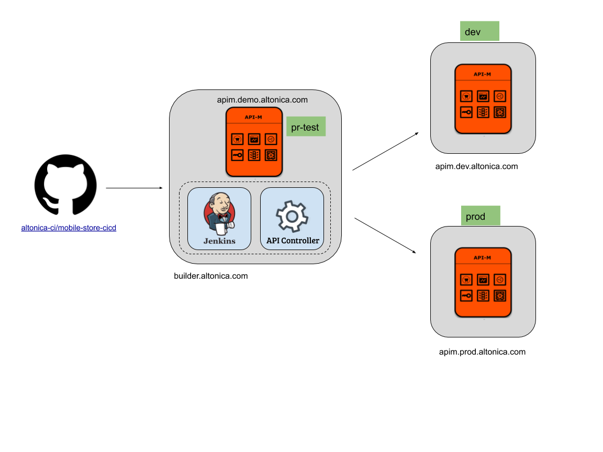

# Automated API Provisioning and Promotion Through CI/CD

## DEMO (CICD)

### Deployment




### Environments

Environments of APICTL are defined as below:

| Environment | Host                                | Description                  |
|-------------|-------------------------------------|------------------------------|
| dev         | https://apim.dev.altonica.com:9443  | Dev Environment              |
| prod        | https://apim.prod.altonica.com:9443 | Prod Environment             |
| pr-test     | https://apim.demo.altonica.com:9443 | Testing purposes for Jenkins |

Make sure Jenkins server is up and running. We are using below URL to refer it.

https://builder.altonica.com:8080

### Steps

#### Configure apictl in Jenkins instance
1. Install apictl in Jenkins instance
2. Configure above 3 environments using apictl
    * eg: Adding dev environment: 
    ```
    apictl add-env --apim https://apim.dev.altonica.com:9443 --token https://apim.dev.altonica.com:8243/token
    ```


#### Setting Up Github
*   Goto Settings -> Webhooks
    *   Add a webhook for the “push” events using http://builder.altonica.com:8080/github-webhook/
#### Setup Jenkins master pipeline : [http://builder.altonica.com:8080](http://builder.altonica.com:8080)
*   Click “New Item”
    *   Set name as**: mobile-store-cicd**
    *   Set type as “Multibranch Pipeline”
    *   Click OK
*   In the next page - General Settings
    *   Setup Branch Sources as [https://github.com/altonica-ci/mobile-store-cicd](https://github.com/altonica-ci/mobile-store-cicd)
    *   JenkinsFile: JenkinsFiles/Jenkinsfile
    *   _Show JenkinsFile and go through it and explain it_
        *   _API CTL commands that are used_
        *   _Running tests_
    *   Under behaviours:
        *   Set Discover All Branches
        *   Regular expression: master
    *   Save
#### Doing the first API provisioning
*   Add the MobileStore-1.0.0 source and send PR to the altonica-ci
    *   Merge the PR
    *   Go to Jenkins and it should automatically trigger the build for **mobile-store-cicd **pipeline.
    *   Notice dev environment API is deployed. dev endpoint is populated
    *   Notice prod environment API is deployed. prod endpoint is populated
#### Doing a breaking change
*   Do a **breaking change**, add a PR and merge it. Notice the tests are are failed and the API is only added to Dev environment. It will not be added to Prod.

#### Setting-up notifying PR events in github
*   Goto Git Settings -> Webhooks
    *   Click Edit on the webhook earlier created
    *   Under “Which events would you like to trigger this webhook?” Select “Let me select individual events.” -> tick Pull requests
#### Setup Jenkins PR-test pipeline : [http://builder.altonica.com:8080](http://builder.altonica.com:8080)
*   Click “New Item”
    *   Set name as: mobile-store-pr-test
    *   Set type as “Multibranch Pipeline”
    *   Click OK
*   In the next page - General Settings
    *   Add Branch source as [https://github.com/altonica-ci/mobile-store-cicd](https://github.com/altonica-ci/mobile-store-cicd)
    *   JenkinsFile: JenkinsFiles/pr-analysis/Jenkinsfile
    *   _Show JenkinsFile and go through it and explain it_
        *   _API CTL commands that are used_
        *   _Running tests_
    *   Under behaviours:
        *   Set Discover All Branches
        *   Regular expression: master
    *   Save
*   Fix the break and send a PR
    *   Observe the “check” initiated for the commit
    *   Merge the PR  
*   Add Additional Protection Steps
    *   Goto Settings -> Branches
        *   Under Branch protection rules Add Rule
        *   Set
            *   Branch name pattern: master
            *   Require status checks to pass before merging
*   Now do another **breaking change**
    *   Send a PR
    *   Observe the “check” on the latest commit on the PR
        *   PR will not be allowed to merge.